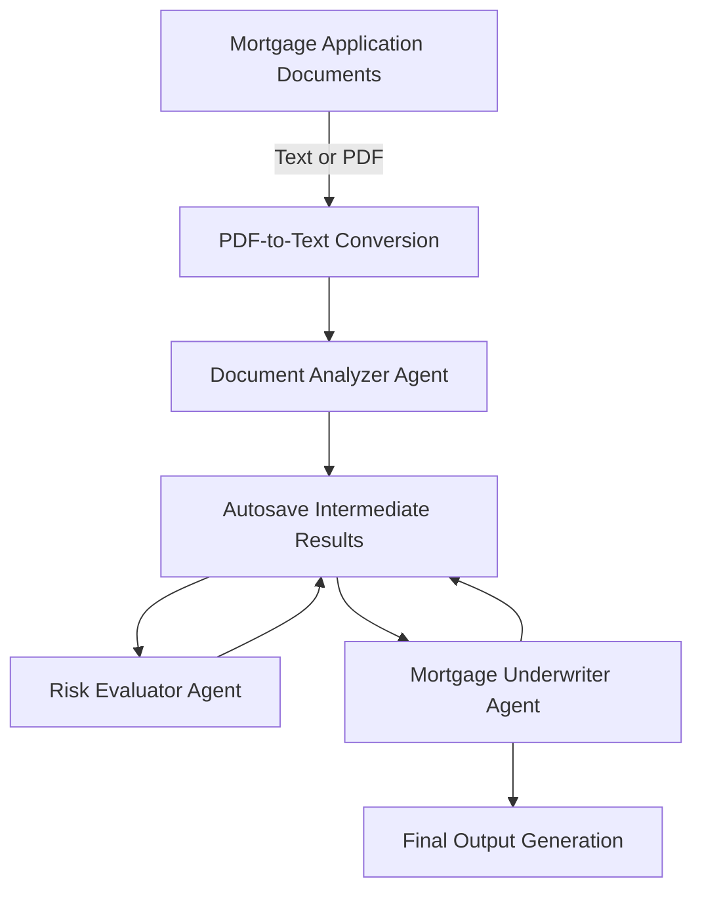
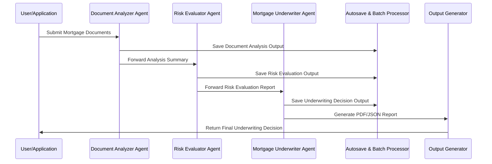

# MortgageUnderwritingSwarm

[](https://discord.gg/swarms) [](https://www.youtube.com/@kyegomez3242) [](https://www.linkedin.com/in/kye-g-38759a207/) [](https://x.com/kyegomezb)


[](https://github.com/The-Swarm-Corporation/Legal-Swarm-Template)
[](https://github.com/kyegomez/swarms)

MortgageUnderwritingSwarm is a multi-agent mortgage underwriting system built with [swarms.ai](https://swarms.ai). It leverages a modular multi-agent architecture to analyze mortgage documents, evaluate risk, and produce final underwriting decisions—all in less than 24 hours. The system supports PDF-to-text conversion, autosaving of intermediate results, flexible output formats (PDF/JSON), and batch processing for multiple applications.

---

## Overview

MortgageUnderwritingSwarm automates the mortgage underwriting process using three specialized agents:

1. **Document Analyzer Agent**  
   Extracts and validates key information from mortgage documents (text or PDF).

2. **Risk Evaluator Agent**  
   Analyzes the extracted data to compute a detailed risk score and evaluation.

3. **Mortgage Underwriter Agent**  
   Integrates all data to render a final underwriting decision (Approved, Conditionally Approved, or Denied).

These agents work sequentially and collaboratively to ensure that the entire underwriting process is both robust and transparent.

---

## Features

- **Advanced Document Processing:**  
  Supports both text and PDF documents with built-in PDF-to-text conversion.

- **Comprehensive Risk Evaluation:**  
  Detailed analysis of financial, credit, and property data to generate a risk score.

- **Automated Underwriting Decisions:**  
  Final decisions include exhaustive explanations that adhere to industry standards.

- **Autosaving & Batch Processing:**  
  Automatically saves intermediate results and supports processing multiple applications concurrently.

- **Flexible Output Formats:**  
  Generate final reports as PDF documents or JSON data structures for seamless integration with other systems.

---

## Architecture

### System Flow Diagram

Below is a high-level overview of how the system processes an application:



### Detailed Architecture Diagram

The following sequence diagram shows how data flows through the system:



---

## Installation

1. **Clone the Repository**

   ```bash
   git clone https://github.com/The-Swarm-Corporation/MortgageUnderwritingSwarm.git
   cd MortgageUnderwritingSwarm
   ```

2. **Install Dependencies**

   This project requires Python 3.8+ along with several libraries:
   
   - `swarms` (from swarms.ai)
   - `PyPDF2`
   - `reportlab`

   Install dependencies using pip:

   ```bash
   pip install -r requirements.txt
   ```

3. **Set Up Your Environment**

   Ensure that any necessary environment variables are configured, particularly if your `swarms.ai` setup requires authentication or API keys.

---

## Usage

### Single Application Processing

To process a single mortgage application, you can run the script directly:

```bash
python mortgage_underwriting_swarm.py
```

Alternatively, import the class into your own Python script:

```python
from mortgage_underwriting_swarm import MortgageUnderwritingSwarm

# Initialize the swarm with a designated autosave directory
swarm = MortgageUnderwritingSwarm(save_directory="./autosave_results")

# Process a single mortgage application
final_pdf_path = swarm.process_application(
    application_data="Your application document text here...",
    return_format="pdf",
    output_filename="Applicant_UnderwritingDecision"
)
print(f"PDF generated at: {final_pdf_path}")
```

### Batch Processing

For processing multiple applications simultaneously:

```python
applications = [
    "Application data for Applicant 1...",
    "Application data for Applicant 2...",
    # Add more application texts as needed
]

# Process applications in batch and return JSON results
results = swarm.process_applications_in_batch(applications, return_format="json")
for result in results:
    print(result)
```

### PDF to Text Conversion

If your input documents are in PDF format, convert them to text using:

```python
text_from_pdf = swarm.pdf_to_text("path_to_document.pdf")
print(text_from_pdf)
```

---

## Technical Details

- **Multi-Agent Architecture:**  
  The system employs three dedicated agents that each focus on a specific task (document analysis, risk evaluation, and final underwriting). Each agent is powered by a GPT-4o-mini model provided by swarms.ai.

- **Autosaving:**  
  Intermediate outputs are autosaved as text files to ensure auditability and traceability.

- **Flexible Output:**  
  The final underwriting decision can be generated as either a PDF report (using ReportLab) or as a JSON object.

- **Batch Processing:**  
  The system supports batch processing, allowing multiple mortgage applications to be processed in a single run.

- **PDF-to-Text Conversion:**  
  Using PyPDF2, the system can convert PDF documents into plain text for further processing by the agents.

---

## Contributing

Contributions are highly welcome! Please follow these guidelines:

1. Fork the repository.
2. Create a feature branch for your changes.
3. Write tests to validate your changes.
4. Submit a pull request with detailed information about your changes.

For any questions or discussion, please open an issue in the repository.


## 🛠 Built With

- [Swarms Framework](https://github.com/kyegomez/swarms)
- Python 3.10+
- GROQ API Key or you can change it to use any model from [Swarm Models](https://github.com/The-Swarm-Corporation/swarm-models)

## 📬 Contact

Questions? Reach out:
- Twitter: [@kyegomez](https://twitter.com/kyegomez)

---

## Want Real-Time Assistance?

[Book a call with here for real-time assistance:](https://cal.com/swarms/swarms-onboarding-session)

---

⭐ Star us on GitHub if this project helped you!

Built with ♥ using [Swarms Framework](https://github.com/kyegomez/swarms)
